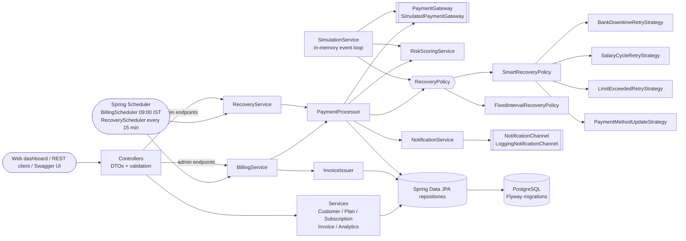
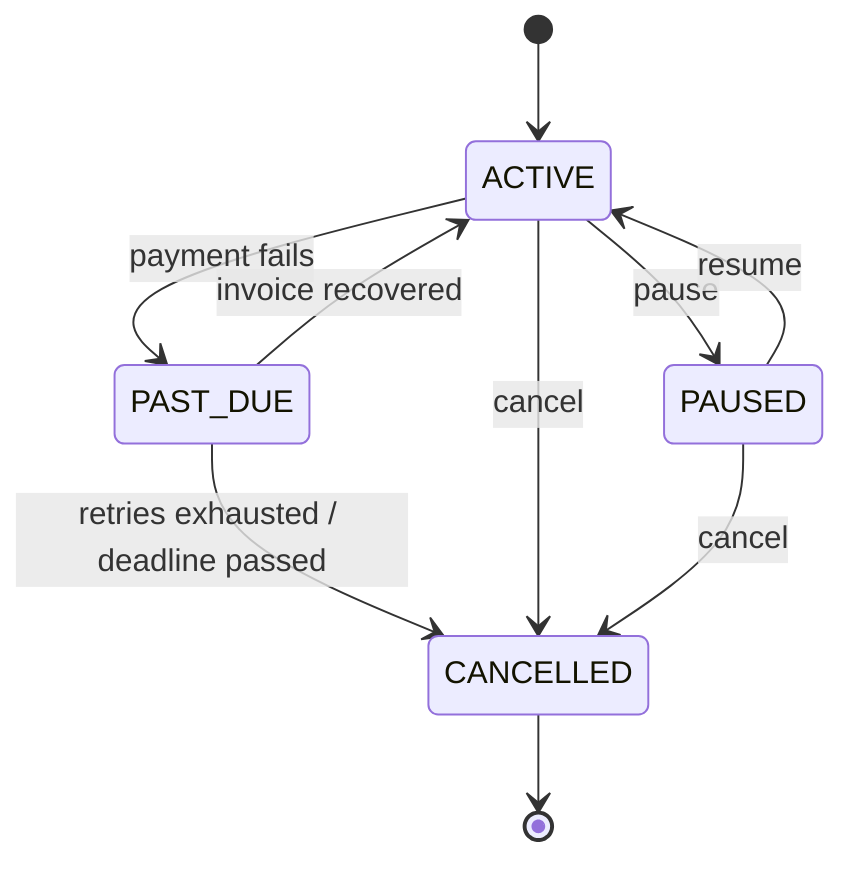
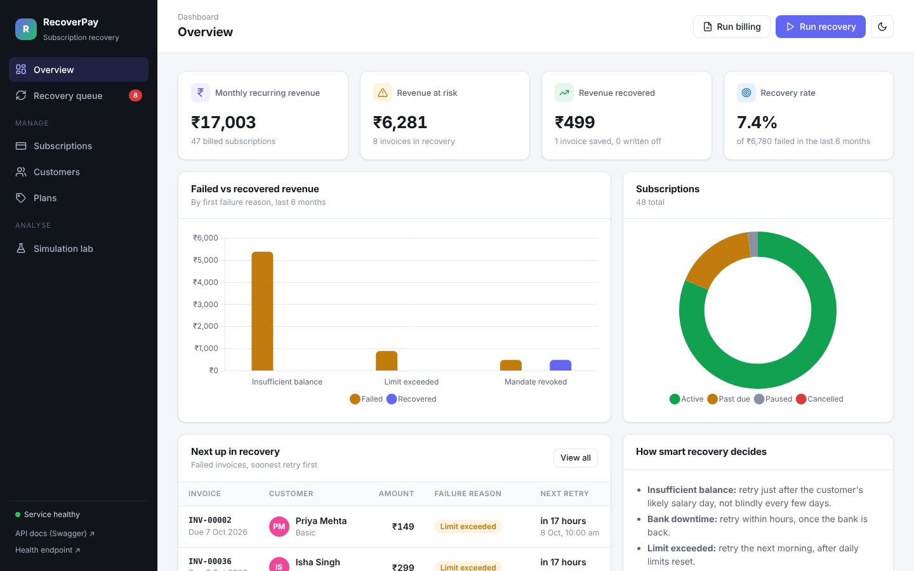
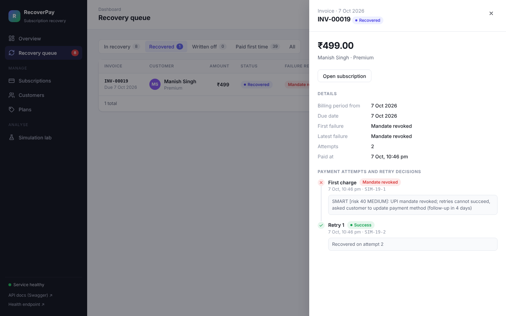

# subscription-recovery-service

A smart **payment-recovery (dunning) service** for subscription businesses in India, built with
Java 17, Spring Boot 3, PostgreSQL and Docker.

## 1. Problem statement

Indian subscription businesses (OTT, SaaS, ed-tech, news) mostly collect renewals through **UPI AutoPay**
mandates and cards. A large share of renewals fail for reasons that have nothing to do with the customer wanting to
leave: low balance before payday, daily UPI limits, bank downtime, revoked mandates, expired cards. If these
failures aren't recovered, the customer churns **involuntarily** and the business loses revenue it should have
collected.

Most billing systems retry on a fixed schedule ("every 3 days, 4 times"). That schedule ignores *why* a payment
failed:

* retrying a **revoked mandate** can never work, and each failed debit sends the customer an annoying bank SMS;
* retrying **low balance** three days later is pointless if salary only arrives on the 1st;
* **bank downtime** is fixed in hours, so waiting three days loses time for nothing.

This service bills subscriptions, detects failures, scores each customer's churn risk and chooses a **retry
strategy per failure reason and risk level**. A built-in simulation compares it with the fixed-retry baseline, and a
**web dashboard** at http://localhost:8080 shows the recovery queue, each invoice's retry decisions, churn risk and
the simulation results.

## 2. Architecture



**Subscription state machine**



Invoice lifecycle: `PENDING → PAID`, or `PENDING → FAILED → RECOVERED | WRITTEN_OFF`.

### Package layout

| Package | Responsibility |
|---|---|
| `controller` | HTTP only: request validation, status codes, delegates to services |
| `dto` | Request/response records + `DtoMapper`. Entities never leave the service layer |
| `service` | Use cases and transactions (`BillingService`, `RecoveryService`, `PaymentProcessor`, ...) |
| `repository` | Spring Data JPA repositories, JPQL queries, analytics projection |
| `domain` | JPA entities and enums, including the `SubscriptionStatus` state machine |
| `gateway` | `PaymentGateway` port + reproducible `SimulatedPaymentGateway` |
| `risk` | Rule-based churn-risk score (0-100) with human-readable factors |
| `retry` | Strategy pattern: one strategy per failure reason, smart and fixed policies |
| `notification` | Message building + pluggable channels (log today; email/SMS later) |
| `scheduler` | Thin `@Scheduled` triggers |
| `simulation` | Synthetic customers + discrete-event simulation, REST endpoint and CLI |
| `exception` | `@RestControllerAdvice` and custom exceptions with one JSON error shape |
| `resources/static` | Web dashboard: plain HTML, CSS and JavaScript served by Spring Boot, Chart.js bundled locally |

## 3. How recovery works

1. **Billing job** (09:00 IST daily): for every `ACTIVE` subscription due today, create an invoice (`PENDING`),
   advance the next billing date, and charge it.
2. **On failure**: invoice becomes `FAILED`, subscription becomes `PAST_DUE`, the customer's failure count goes up,
   a 28-day recovery deadline starts, and the **risk score** is computed.
3. The **RecoveryPolicy** decides what to do next:

| Failure reason | Smart strategy |
|---|---|
| `BANK_DOWNTIME` | Retry in 2h, 4h, 8h (exponential backoff). No customer message: it isn't their fault |
| `INSUFFICIENT_BALANCE` | Retry at 10:00 on the next **1st or 5th** (salary dates). From the 2nd failure, send a heads-up the day before |
| `LIMIT_EXCEEDED` | Retry next morning (limits reset at midnight), then every 2 days |
| `MANDATE_REVOKED`, `CARD_EXPIRED` | **No blind retries.** Send an "update payment method" message now and one follow-up; retry immediately when the customer updates their mandate/card |

   Risk adjustments on top: retry budget is **4 / 3 / 2** for LOW / MEDIUM / HIGH risk, and HIGH-risk customers get
   a reminder on the **first** soft failure and a sooner hard-decline follow-up (2 days instead of 4).
4. **Recovery job** (every 15 min): retries whose time has come, follow-up reminders, and invoices past their
   deadline (written off, subscription `CANCELLED`).
5. Every attempt is stored in `payment_attempts` with a **decision note** explaining the choice, e.g.
   `SMART [risk 85 HIGH]: UPI mandate revoked; retries cannot succeed, asked customer to update payment method`.

### Risk score (0-100)

```
score = tenurePoints + failurePoints + pricePoints   (capped at 100)
tenure:   < 3 months 35 | 3-11 20 | 12-23 10 | 24+ 0
failures: 12 per past failure, max 40
price:    >= INR 1500 25 | >= 750 15 | >= 300 8 | else 0
bands:    LOW < 35 | MEDIUM 35-64 | HIGH >= 65
```

## 4. Running it

### With Docker (app + PostgreSQL)

```bash
docker compose up --build
# Dashboard:  http://localhost:8080
# API:        http://localhost:8080/api/...
# Swagger UI: http://localhost:8080/swagger-ui.html
# Health:     http://localhost:8080/actuator/health
```

### Web dashboard

Open http://localhost:8080. On an empty database the overview page offers **Load demo data**: 5 plans and 48
customers on UPI AutoPay and cards, then today's billing run, so a handful of payments fail straight away.

| Page | What it shows |
|---|---|
| Overview | MRR, revenue at risk, revenue recovered, recovery rate; failed vs recovered revenue by reason; next retries |
| Recovery queue | Invoices by status (in recovery, recovered, written off, paid). Click one to see every attempt and the reason for each retry decision |
| Subscriptions | Filter by status, create, pause, resume, cancel, update the payment method |
| Customers | Add and edit customers; each customer's churn-risk score with the factors behind it |
| Plans | Create and edit plans and prices |
| Simulation lab | Run the smart vs fixed simulation with your own customer count, months and seed, with charts |

The top bar runs the billing and recovery jobs on demand, and the moon button switches to dark mode.





To watch a hard decline recover: open an invoice that failed with *Mandate revoked* or *Card expired*, click
**Customer updated payment method**, and the invoice is retried at once and moves to *Recovered*. Soft declines
(low balance, limits, downtime) are retried at their scheduled time by the recovery job, which runs every 15 minutes.

The dashboard has no build step: `src/main/resources/static/index.html`, `css/app.css` and `js/app.js` are served
as they are, and it calls the same REST API as any other client.

### Locally

```bash
docker compose up -d postgres      # or any PostgreSQL 16 with db/user/password "recovery"
mvn spring-boot:run
```

### Tests

```bash
mvn test      # 49 unit tests: strategies, policies, risk score, state machine, gateway, simulation
mvn verify    # + 12 integration tests on a real PostgreSQL via Testcontainers (needs Docker)
```

### Configuration

| Property | Default | Meaning |
|---|---|---|
| `DB_URL`, `DB_USERNAME`, `DB_PASSWORD` | `jdbc:postgresql://localhost:5432/recovery`, `recovery`, `recovery` | Database |
| `billing.cron` | `0 0 9 * * *` | Billing job (IST) |
| `recovery.cron` | `0 */15 * * * *` | Recovery job |
| `recovery.policy` / `RECOVERY_POLICY` | `SMART` | `SMART` or `FIXED` |
| `recovery.recovery-window-days` | `28` | Days before an unpaid invoice is written off |
| `gateway.seed` | `42` | Seed for the simulated gateway |

## 5. API

23 operations; the full list with schemas is in Swagger UI.

| Method | Path | Purpose |
|---|---|---|
| POST / GET | `/api/customers` | Create / list (paged) customers |
| GET / PUT | `/api/customers/{id}` | Get / update a customer |
| GET | `/api/customers/{id}/risk` | Churn-risk score with factors |
| POST / GET | `/api/plans` | Create / list plans |
| GET / PUT | `/api/plans/{id}` | Get / update a plan |
| POST / GET | `/api/subscriptions` | Create / list subscriptions (`?status=PAST_DUE`) |
| GET | `/api/subscriptions/{id}` | Get a subscription |
| PATCH | `/api/subscriptions/{id}/status` | Pause / resume / cancel (state machine enforced) |
| PUT | `/api/subscriptions/{id}/payment-method` | New mandate/card; failed invoices retried right away |
| GET | `/api/subscriptions/{id}/invoices` | Invoices of a subscription |
| GET | `/api/invoices?status=FAILED` | Invoices (paged) with customer and plan names; `status` can repeat |
| GET | `/api/invoices/{id}` | Invoice with full attempt history and decision notes |
| GET | `/api/analytics/overview` | Snapshot: customers, subscriptions by status, MRR, revenue at risk |
| GET | `/api/analytics/recovery?from=&to=` | Failed vs recovered revenue, rate, breakdown by reason |
| POST | `/api/admin/jobs/billing` | Run the billing job now |
| POST | `/api/admin/jobs/recovery` | Run the recovery job now |
| POST | `/api/admin/jobs/demo-data` | Load demo plans, customers and subscriptions into an empty database, then bill them |
| POST | `/api/simulations` | Smart vs fixed simulation |

### curl examples (real responses from a run of the Docker stack)

```bash
curl -X POST localhost:8080/api/plans -H 'Content-Type: application/json' \
  -d '{"name":"Premium","monthlyPrice":499.00,"billingCycle":"MONTHLY"}'
# 201 {"id":1,"name":"Premium","monthlyPrice":499.00,"billingCycle":"MONTHLY","pricePerCycle":499.00,"active":true}

curl -X POST localhost:8080/api/customers -H 'Content-Type: application/json' \
  -d '{"name":"Priya Sharma","email":"priya@example.in","signupDate":"2025-01-15"}'
# 201 {"id":1,"name":"Priya Sharma","email":"priya@example.in","signupDate":"2025-01-15","tenureMonths":20,"pastFailureCount":0}

curl -X POST localhost:8080/api/subscriptions -H 'Content-Type: application/json' \
  -d '{"customerId":1,"planId":1,"paymentMethod":"UPI_AUTOPAY"}'
# 201 {"id":1,"customerId":1,"customerName":"Priya Sharma","planId":1,"planName":"Premium","status":"ACTIVE",
#      "nextBillingDate":"2026-10-07","paymentMethod":"UPI_AUTOPAY","startDate":"2026-10-07"}

curl localhost:8080/api/customers/7/risk
# {"customerId":7,"score":96,"band":"HIGH","factors":["Tenure 1 month(s): +35",
#   "3 past payment failure(s): +36","Plan price INR 1999/month: +25"]}

curl -X POST localhost:8080/api/admin/jobs/billing          # 40 subscriptions due today
# {"job":"billing","processed":40,"succeeded":28,"failed":12}

curl localhost:8080/api/invoices/19                         # a revoked mandate
# {"id":19,"status":"FAILED","initialFailureReason":"MANDATE_REVOKED","attemptCount":1, ...
#  "attempts":[{"attemptNumber":1,"result":"FAILED","failureReason":"MANDATE_REVOKED",
#  "decisionNote":"SMART [risk 85 HIGH]: UPI mandate revoked; retries cannot succeed, asked customer to update
#   payment method (follow-up in 2 days)"}]}

curl -X PUT localhost:8080/api/subscriptions/19/payment-method -H 'Content-Type: application/json' \
  -d '{"paymentMethod":"UPI_AUTOPAY"}'                       # customer re-authorised AutoPay
curl -X POST localhost:8080/api/admin/jobs/recovery
# {"job":"recovery","processed":1,"succeeded":1,"failed":0}  -> invoice 19 is now RECOVERED

curl -X PATCH localhost:8080/api/subscriptions/2/status -H 'Content-Type: application/json' \
  -d '{"status":"PAUSED"}'
# 409 {"status":409,"error":"Conflict","message":"Cannot move subscription from PAST_DUE to PAUSED", ...}

curl -X POST localhost:8080/api/customers -H 'Content-Type: application/json' \
  -d '{"name":"","email":"bad","signupDate":"2030-01-01"}'
# 400 {"status":400,"message":"Validation failed","fieldErrors":{"email":"must be a well-formed email address",
#      "signupDate":"must be a date in the past or in the present","name":"must not be blank"}, ...}

curl 'localhost:8080/api/analytics/recovery?from=2026-10-01&to=2026-10-31'
# {"failedInvoices":12,"recoveredInvoices":0,"invoicesStillInRecovery":12,"totalFailedRevenue":14988.00,
#  "recoveryRatePercent":0.00,"byFailureReason":[{"reason":"BANK_DOWNTIME","failedInvoices":6, ...}, ...]}
#  (taken right after billing, before any retry was due)

curl -X POST localhost:8080/api/simulations -H 'Content-Type: application/json' \
  -d '{"customers":1000,"months":6,"seed":42}'
```

Reminder messages are written to the log by `LoggingNotificationChannel`:

```
NOTIFY channel=log type=UPDATE_PAYMENT_METHOD to=c19@example.in subject="Action needed: update your payment method"
  body="Hi Customer 19, your UPI AutoPay mandate or card is no longer valid, so we can't collect INR 1999.00. ..."
```

## 6. Simulation results

Run it with no database:

```bash
mvn -q compile exec:java                         # 1000 customers, 6 months, seed 42
mvn -q compile exec:java -Dexec.args="5000 12 7"  # customers months seed
```

The simulation generates 1,000 synthetic customers, then replays six months of billing **twice**, once with each
policy, on the same customers and the same random seed. It reuses the production `SimulatedPaymentGateway`,
`RiskScoringService` and retry policies, driven by an in-memory discrete-event loop (about 0.1 s per run).

Results for seed 42 (full output in [`docs/simulation-results.txt`](docs/simulation-results.txt)):

| Metric | SMART | FIXED |
|---|---:|---:|
| Invoices with a failed payment | 1,486 | 1,363 |
| **Recovery rate (revenue)** | **86.13%** | **76.28%** |
| Recovery rate (invoices) | 87.01% | 78.06% |
| Recovered revenue | INR 8,22,157 | INR 6,51,636 |
| Policy retries (gateway calls) | 1,778 | 2,573 |
| Reminders sent | 1,091 | 2,978 |
| Cancellations caused by retry fatigue | 18 | 67 |
| Active subscriptions after 6 months | 807 | 701 |
| Total revenue collected | INR 34,89,520 | INR 31,90,236 |
| Avg days to recover | 7.4 | 4.6 |

| First failure reason | SMART | FIXED |
|---|---:|---:|
| INSUFFICIENT_BALANCE | 89.2% | 80.0% |
| MANDATE_REVOKED | 41.4% | 30.9% |
| CARD_EXPIRED | 63.6% | 43.3% |
| BANK_DOWNTIME | 98.9% | 92.0% |
| LIMIT_EXCEEDED | 100.0% | 98.8% |

**Robustness:** seed 42 is on the favourable end. Across seeds 1-10 the smart policy wins every time, by
**3.5 to 9.0 percentage points (mean 6.6)**.

**How to read this honestly**

* The numbers come from a **model** of customer and bank behaviour, not production data. The assumptions are listed
  in the API response (`modelAssumptions`) and in `SimulationService`. The value of the simulation is comparing
  policies under the *same* assumptions, and making those assumptions explicit and testable.
* Smart recovery is **slower** on average (7.4 vs 4.6 days) because it deliberately waits for salary dates instead
  of retrying early. It wins on *how much* is recovered, with 31% fewer gateway calls and 63% fewer messages.
* The smart policy sees *more* failed invoices because it keeps more customers subscribed, so they get billed more
  often. Compare total revenue collected and active subscriptions, not only the rate.

## 7. Design decisions

* **Strategy pattern for retries.** One class per failure family (`RetryStrategy`), selected by
  `SmartRecoveryPolicy` from an `EnumMap`. New reason = new class; each rule set is unit-tested on its own. The
  policy fails fast at startup if any `FailureReason` has no strategy.
* **Policy interface for A/B comparison.** `SmartRecoveryPolicy` and `FixedIntervalRecoveryPolicy` implement
  `RecoveryPolicy`, so the live service (`recovery.policy`) and the simulation can swap them.
* **Explicit state machine.** Allowed transitions live in one `EnumMap` in `SubscriptionStatus`; the entity has no
  status setter, only `transitionTo()`, which throws `InvalidStateTransitionException` (HTTP 409).
* **Recovery state on the invoice row** (`next_retry_at`, `next_reminder_at`, `recovery_deadline`). The scheduler
  is stateless: each run queries what is due, so restarts and multiple instances lose nothing.
* **One transaction per invoice.** `BillingService` / `RecoveryService` loop over IDs and call separate beans
  (`InvoiceIssuer`, `PaymentProcessor`) so each invoice commits on its own. (Calling a `@Transactional` method on
  `this` would bypass Spring's proxy.)
* **Idempotent billing.** `UNIQUE (subscription_id, period_start)` means a re-run or a second instance can never
  bill the same period twice; `PENDING` invoices left by a crash are charged on the next run.
* **Optimistic locking** (`@Version`) on subscriptions and invoices prevents lost updates between the jobs and the API.
* **Reproducible gateway.** Outcomes come from `DeterministicRandom.uniform(seed, customer, day, ...)`, a hash of
  *what* is happening rather than call order, so the two policies face an identical world.
* **Injected `Clock`** (Asia/Kolkata). Tests move time forward with a `MutableClock` instead of sleeping.
* **Flyway, not `ddl-auto=update`.** The schema and indexes are reviewed SQL under version control; Hibernate only
  validates.
* **DTOs everywhere** (Java records) and **`open-in-view: false`**, so no lazy-loading surprises during JSON
  serialisation and the API contract is independent of the table layout.
* **BigDecimal for money**, never `double`.
* **Explainable risk score** instead of a black-box model: support can tell a customer exactly why they got fewer
  retries.

### Database indexes

| Index | Serves |
|---|---|
| `idx_subscriptions_status_next_billing (status, next_billing_date)` | Billing job: `status = 'ACTIVE' AND next_billing_date <= today`. Equality column first, range second |
| `idx_invoices_retry_due (next_retry_at) WHERE status = 'FAILED'` | Recovery job. **Partial index**: only failed invoices are indexed, so it stays tiny as paid invoices pile up |
| `idx_invoices_reminder_due`, `idx_invoices_deadline` (partial, same idea) | Follow-up reminders and write-offs |
| `idx_invoices_failure_reason_due (initial_failure_reason, due_date)` partial | Analytics GROUP BY reason over a date range |
| `uk_invoices_subscription_period` unique | Idempotent billing + "invoices of a subscription" |
| `uk_attempts_invoice_number` unique | Attempt history in order; no duplicate attempt numbers |
| `idx_subscriptions_customer`, `uk_customers_email`, `uk_plans_name` | FK lookups (Postgres doesn't index FKs automatically) and uniqueness |

## 8. Future improvements

* **Distributed scheduling lock** (ShedLock) so only one instance runs each job; today correctness relies on the unique
  constraint and optimistic locking, but work could be duplicated.
* **Transactional outbox** for notifications: write messages to a table in the same transaction, send after commit.
* **Real gateway adapter** (Razorpay / Cashfree) with webhooks for asynchronous UPI results and idempotency keys.
* **Learn the salary day per customer** from their past successful payment dates instead of assuming 1st/5th.
* **ML risk model** behind the same `RiskScoringService` interface, trained on real outcomes; A/B test it with the
  simulation first, then with a live traffic split.
* **Pre-debit notification**: NPCI requires a notice 24h before each UPI AutoPay debit; add it to the billing flow.
* **Security**: Spring Security (OAuth2/JWT) and role-based access for `/api/admin/**` and the dashboard.
* **Observability**: Micrometer metrics (recovery rate, retries per reason) and dashboards.
* **Batch processing** with keyset pagination for millions of subscriptions.

## 9. Build notes

All 61 tests pass with `mvn verify` (Java 17 target, built on JDK 21, Docker for Testcontainers). Every dashboard
page was checked in headless Chromium at desktop and phone widths, in light and dark mode, with no console errors. The compose stack
(app + Postgres, both healthy) was run and the curl calls above were made against it. In the build sandbox the
Dockerfile's Maven stage could not download dependencies through the sandbox's HTTPS proxy, so the runtime stage was
verified with a jar built outside Docker; on a normal machine `docker compose up --build` builds everything.
